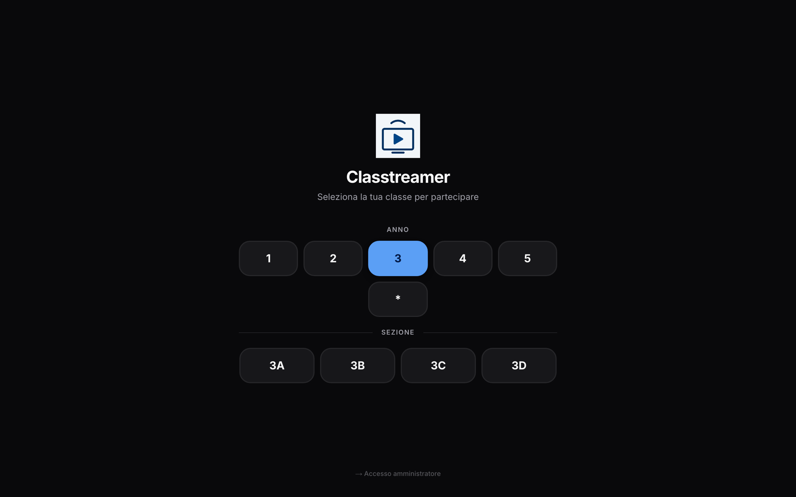
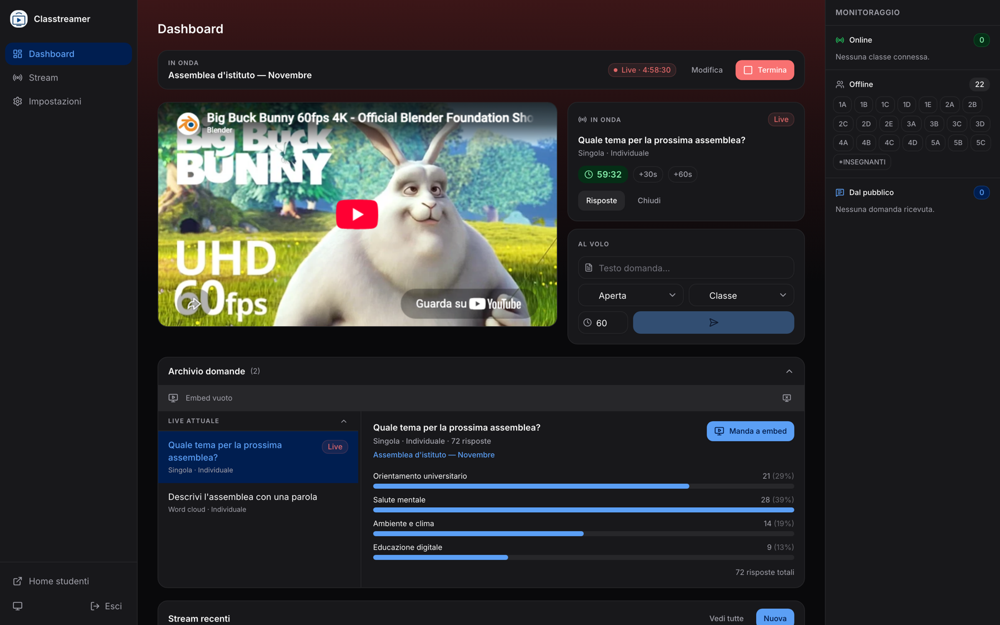
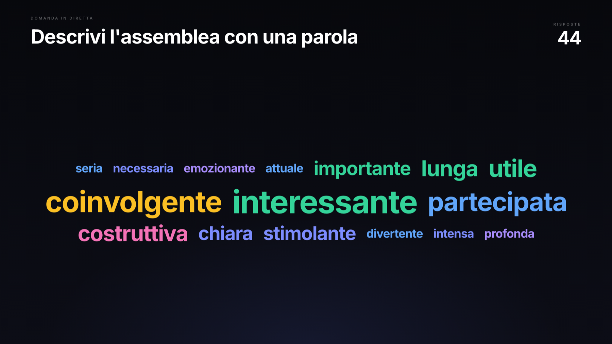
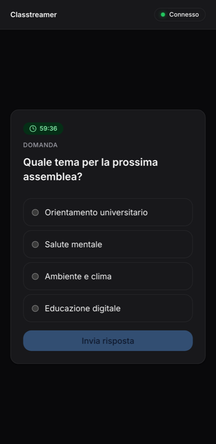

# Classtreamer

[](https://github.com/mmattia09/classtreamer/actions/workflows/ci.yaml)
[](https://github.com/mmattia09/classtreamer/actions/workflows/docker-image.yaml)
[](https://github.com/mmattia09/classtreamer/releases)
[](LICENSE)

[](https://nextjs.org)
[](https://www.typescriptlang.org)
[](https://www.prisma.io)
[](https://www.postgresql.org)
[](https://bun.sh)

Stream a school assembly to every classroom and get the room to answer back.
Each class opens its own page, the stream plays full screen, and the control
room pushes live questions that students answer either from the classroom
display or from their own phone. Results go on air as an OBS overlay.

Self-hosted and built to run from a single laptop: an OBS scene, a projector per
room, a browser. The interface is in Italian. There are no student accounts, no
sign-ups and no third-party analytics.

## Screenshots

|  |  |
| --- | --- |
|  |  |
| Students pick their class | The stream, with a QR code to answer from a phone |


*Control room: what is live, viewers per class, and one-click question controls*

| | |
| --- | --- |
|  |  |
| The OBS overlay, sized to read from the back of a room | Answering from a phone |

## Features

- **A page per classroom.** `/class/1/A` plays the stream full screen. Classes
  use a compact notation — `1A-E, 3A-D, 3E, INSEGNANTI` expands to the whole
  list, and non-numbered classes live alongside the numbered ones.
- **Five question formats:** open text, word cloud, numeric scale, single and
  multiple choice, tallied as answers arrive.
- **Two audiences per question.** *Class* is answered once from the display;
  *individual* puts a QR code on screen and every student answers from their own
  phone. No app, no sign-in.
- **Optional timer,** with a countdown on every screen and an *extend* control.
  Late submissions are rejected server-side, not just hidden.
- **Questions from the audience** at any moment during a live. They reach the
  dashboard only, never the other students' screens.
- **OBS overlay** at `/embed/results`: a transparent browser source showing the
  current results or a highlighted question. For open answers the control room
  picks which submissions go on screen.
- **Stream editor** with schedule, target classes and a drag-and-drop question
  list. A stream targeting no class is visible to all of them; past streams can
  be duplicated.
- **Archive and CSV export,** per question or per stream, with spreadsheet
  formula injection neutralised.
- **One answer per device,** enforced by a database constraint.
- **Light, dark or system theme,** applied before the first paint.

## How it works

A single Node process serves the Next.js app and a Socket.IO server side by side
(`server.js`). Everything the control room does is pushed over the socket;
polling is only a fallback for when the socket drops.

| Piece | Role |
| ----- | ---- |
| Next.js 16 (App Router) + React 19 | Pages and API routes |
| Socket.IO | Live push to classrooms, phones and the overlay |
| PostgreSQL + Prisma 7 | Streams, questions, answers, settings |
| Redis | Rate limiting |
| Tailwind CSS | Interface |
| Zod | Validation on every write endpoint |

Installation-wide state — including what the overlay is showing — lives in the
database, so a container restart mid-assembly loses nothing.

## Installation

Requires [Docker](https://docs.docker.com/get-docker/) with Compose.

```bash
git clone https://github.com/mmattia09/classtreamer.git && cd classtreamer
cp .env.example .env
# Edit .env — at minimum:
#   ADMIN_PASSWORD → the control room password
#   SESSION_SECRET → openssl rand -base64 32
docker compose up -d
```

Compose pulls the published image, starts Postgres and Redis, applies the schema
through a one-shot `db-init` service, then serves the app on
<http://localhost:3000>. The same image runs the app and the migrations, with a
different command.

Migrations are applied on every `docker compose up`. A database created before
migrations existed is baselined automatically, and nothing destructive happens
silently: if the schema has diverged in a way that would lose data, `db-init`
stops and the app does not start.

Postgres and Redis are **not published to the host** — the app reaches them over
the Compose network. The mappings are in `docker-compose.yaml`, commented, if
you need to inspect the database from the machine itself.

The image is published to `ghcr.io/mmattia09/classtreamer` on every push to
`main` and every `v*.*.*` tag.

### Configuration

Only `ADMIN_PASSWORD` and `SESSION_SECRET` are required; everything else has a
working default.

| Variable | Default | Purpose |
| -------- | ------- | ------- |
| `ADMIN_PASSWORD` | — | **Required.** Control room password. A value starting with `$2` is treated as a bcrypt hash. |
| `SESSION_SECRET` | — | **Required.** Signs the admin session cookie (`openssl rand -base64 32`). |
| `APP_TAG` | `latest` | Image tag Compose pulls. Pin a release to control upgrades. |
| `PUBLIC_URL` | `http://localhost:3000` | Public URL, used for the QR code on the displays. |
| `PORT` | `3000` | Host port the app is published on. |
| `SESSION_COOKIE_SECURE` | auto | `true` to force the `Secure` flag; empty decides from the request. |
| `DB_NAME` · `DB_USER` · `DB_PASSWORD` | `classtreamer` | Postgres credentials; the connection URL is derived from them. |
| `DB_HOST_PORT` · `REDIS_HOST_PORT` | `5432` · `6379` | Host ports, used only by the development overlay. |
| `ANSWER_IP_RATE_LIMIT` | `3000` | Answers accepted from one IP per 10s. |
| `AUDIENCE_QUESTION_IP_RATE_LIMIT` | `600` | Audience questions accepted from one IP per minute. |
| `LOG_LEVEL` | `info` in production | `debug`, `info`, `warn` or `error`. Logs are one JSON object per line. |

The app refuses to start in production without `ADMIN_PASSWORD` and a real
`SESSION_SECRET`. Changing `ADMIN_PASSWORD` invalidates every existing session.

Students are rate limited **per device**, not per IP: a school NATs every phone
behind one address, so a per-IP limit would count a whole class as one client.
The two `*_IP_RATE_LIMIT` values are only a flood guard against a script and sit
far above what a real assembly produces — the defaults fit roughly 3000 students
answering at once.

## Usage

1. Sign in at `/admin`, open **Impostazioni** and enter your classes. The app
   name and logo are set here too.
2. Create a stream under **Stream → Nuova stream**: title, the player's embed
   URL, when it starts, which classes may see it, and the questions you want
   ready. Leave the class list empty to show it everywhere.
3. Open each classroom on `/` and pick year and section, then bookmark the
   resulting URL on the projector.
4. Once live, push questions one at a time from the dashboard.
5. In OBS, add a browser source on `<PUBLIC_URL>/embed/results` with a
   transparent background, and choose from the dashboard what it shows.
6. Afterwards, export the answers as CSV from the stream page.

| Route | What it is |
| ----- | ---------- |
| `/` | Class picker |
| `/class/[year]/[section]` | Classroom view |
| `/answer` | Phone page for individual questions |
| `/embed/results` | OBS overlay |
| `/admin` · `/admin/dashboard` | Login and live control |
| `/admin/streams` · `/admin/classes` | Streams, archive, classes and branding |
| `/api/health` | Health check — reports database and Redis |

## Performance

Measured on a production build with the app, Postgres, Redis and the load
generator all on one machine; a dedicated server does better.

| Load | Result |
| ---- | ------ |
| 1000 answers submitted at once | all accepted, p95 770 ms |
| 2500 answers at once | all accepted, 611/s, p95 1.6 s |
| 3000 open sockets + 2000 answers at once | all accepted, p95 1.19 s, 393 MB RSS |

Every phone on `/answer` holds a socket open, not just the classroom displays,
so a 500–1000 student assembly sits comfortably inside these numbers. One
instance tops out around 2000–3000 concurrent users. The video itself never
touches this server — students load it from the streaming platform — so the
school network is usually the real bottleneck.

## Privacy and security

Built for minors, so it collects as little as possible.

- **No accounts.** An answer carries the class it came from and nothing else.
- **The device cookie is not an identity:** a random opaque value, `httpOnly`,
  unreadable by page scripts, used only to stop one phone answering twice.
- **Live events are scoped.** Viewer counts (which include IP addresses) and
  incoming audience questions go to the control room only.
- **The admin session** is a signed cookie with the expiry inside the signature,
  checked server-side and compared in constant time.
- **Write endpoints are validated** with Zod; URLs bound for an iframe or a
  favicon are restricted to `http(s)`.

Worth knowing: **`/embed/results` and `/api/embed/state` are unauthenticated**,
because OBS loads the overlay without credentials. Anyone who can reach the app
can read the results of the question currently on the overlay. Keep the app off
the public internet, or put the overlay behind your reverse proxy.

## Backups and updates

Everything lives in the `postgres_data` Docker volume, there is no automatic
backup, and `docker compose down -v` deletes that volume without asking. Take a
dump before upgrading:

```bash
docker compose exec -T postgres pg_dump -U "$DB_USER" "$DB_NAME" | gzip > classtreamer-$(date +%F).sql.gz
```

Restore into an empty database:

```bash
gunzip -c classtreamer-2026-05-01.sql.gz | docker compose exec -T postgres psql -U "$DB_USER" -d "$DB_NAME"
```

The dump includes the migration history, so a restored database carries on from
where it left off. To update:

```bash
docker compose pull && docker compose up -d
```

## Contributing

Issues and pull requests are welcome.

```bash
bun install
cp .env.example .env
bun run dev:start
```

`bun run dev:start` starts Postgres and Redis, applies the schema, seeds it and
runs the app. It recreates `.env` from `.env.example` every time, so switch to
`bun run dev` once your environment is set up. In development the app runs on
the host rather than in a container, so `docker-compose.dev.yaml` publishes
Postgres and Redis on `127.0.0.1`; `dev:start` passes it automatically.

Before opening a PR, make sure these pass — CI runs the same checks:

```bash
bun run lint && bun run typecheck && bun run test && bun run build
```

Tests are plain `bun test`. The logic worth testing lives in pure modules that
never touch the database — class parsing, result tallying, CSV escaping, timer
states, validation schemas, overlay layout — so a test needs no fixtures and no
running server.

Schema changes go in `prisma/schema.prisma`, with a migration committed
alongside:

```bash
bun run prisma:migrate:new --name descrizione_della_modifica
```

The connection URL is never written by hand: it is derived from the `DB_*`
variables in `lib/database-url.ts`, which both the app and the Prisma CLI
import.

## Support

Questions and bug reports → [GitHub Issues](https://github.com/mmattia09/classtreamer/issues).

## Authors and acknowledgment

Made by [@mmattia09](https://github.com/mmattia09). Originally written with
OpenAI Codex, then reviewed, hardened and updated with
[Claude Code](https://claude.com/claude-code).

## License

[MIT](LICENSE).

## Project status

**Stable, not yet in production.** Feature-complete for what its author needs
from a school assembly, with the critical paths covered by tests and load
testing, but it has not run a real assembly yet. Bug fixes and small
improvements land as needed; there is no planned feature work.
